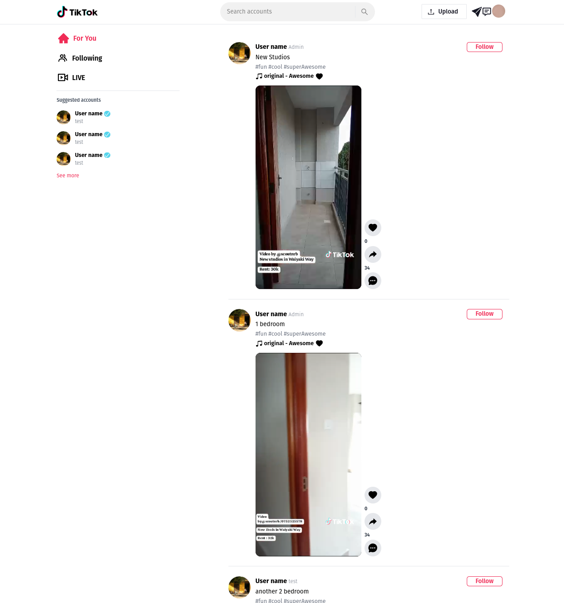

## TikTok Clone

This is a POC project to demostrate the use Graphql, Nestjs, React and Docker compose

### Getting Started
- Clone the project
- Run
  ```
  ./start.sh
  ```

Client will be accessible on `http://localhost:5173`

Server will be accessible on port `3000/graphql`

Images and Videos are stored under `api/public` folder




